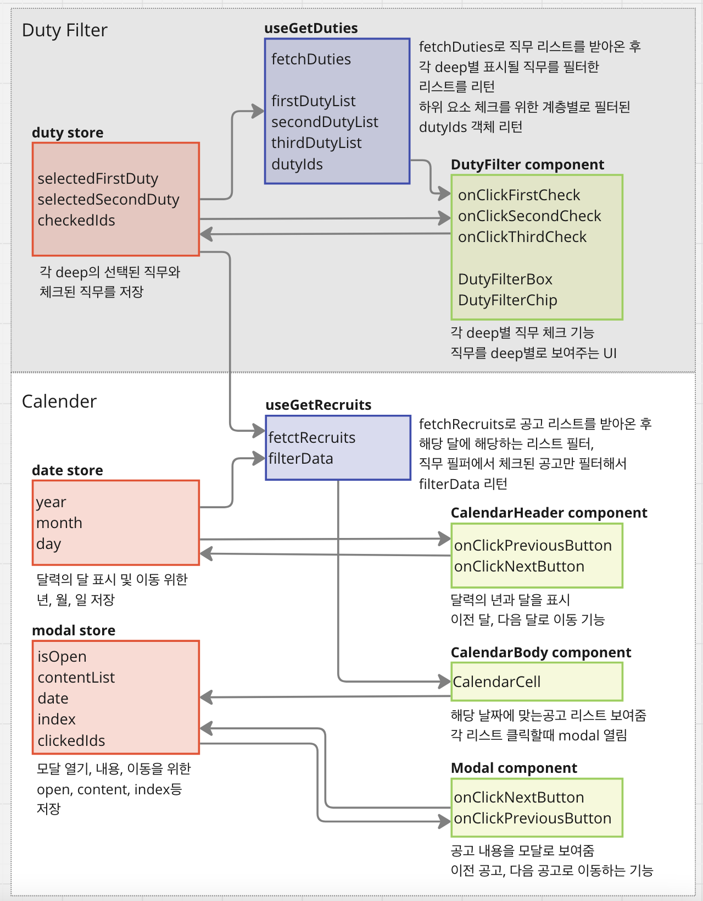

# 채용 달력

이 프로젝트는 날짜별로 채용 공고를 확인할 수 있는 달력이 있는 웹페이지입니다. <br/>
달력의 칸 별로 해당 날짜의 시작일과 마지막날인 공고가 있는 회사 리스트를 볼 수 있고, 회사 이름을 클릭해 채용 상세를 확인 할 수 있으며, 직무별로 필터해서 공고를 볼 수 있습니다.

## 주요 기능

- 달력 상단의 월 네비게이션을 통해 달력의 달을 이동할 수 있습니다.
- 달력의 날짜별로 시작일과 마지막날인 채용공고가 있는 회사 이름을 확인 할 수 있습니다.
  - 시작일자의 경우 '시' 마지막날인 경우 '끝'이 회사 이름 앞에 표시됩니다.
  - 회사 이름을 클릭하여 공고 상세 내용을 확인 할 수 있습니다.
  - 이미 클릭한 회사 이름은 흐리게 표시됩니다.
- 상단의 직무 필터를 통해 공고를 필터할 수 있습니다.
  - 직무 필터는 세개의 계층으로 이루어져있습니다.
  - 직무를 선택할 경우 하위 직무를 볼 수 있습니다.
  - 상위 직무를 선택할 경우 하위 직무가 모두 선택됩니다.
- 달력 칸 안의 회사 이름을 클릭하여 채용 공고 상세 모달을 볼 수 있습니다.
  - 모달 안에서 회사 이름, 채용 타이틀, 채용 기간, 채용 이미지를 볼 수 있습니다.
  - 모달을 띄운 상태에서 이전 공고와 다음 공고로 이동할 수 있습니다.
  - 필터가 되어 있는 경우 필터된 공고로만 이동됩니다.

## 기술 스택

- next.js: 파일 기반 라우팅으로 프로젝트 구조와 코드 가독성이 높다.
- typeScript : 코드의 안정성과 오류를 줄이기 위해 사용
- tailwindCSS : 스타일링을 위해 사용. 미리 세팅된 유틸리티 클래스를 활용하여 HTML 코드 내에서 스타일링 가능하다.
- zustand : 전역 상태 관리를 위해 사용. 보일러플레이트가 거의 없고 사용하기 간단하다.
- react-query : 효율적인 데이터 페칭과 캐싱을 위해 사용.

## 폴더 구조

```
src/
├── app/          # page 파일
├── components/
  ├── calendar/   # 달력 컴포넌트
  ├── dutyFilter/ # 직무 필터 컴포넌트
  └── modal/      # 채용 상세 모달 컴포넌트
├── query/        # 데이터 페칭 및 가공
├── store/        # 전역 상태 관리
├── lib/          # 유틸리티 함수 및 상수
└── type/         # 타입 관리
```

## 구조



## 설치 및 시작

1.  설치

```
npm install
또는
yarn install
```

2.  개발서버 실행

```
npm run dev
또는
yarn dev
```

3. 브라우저 접속
   http://localhost:3000/

\*\* 이 프로젝트는 PC 화면에 최적화 되어 있습니다.
